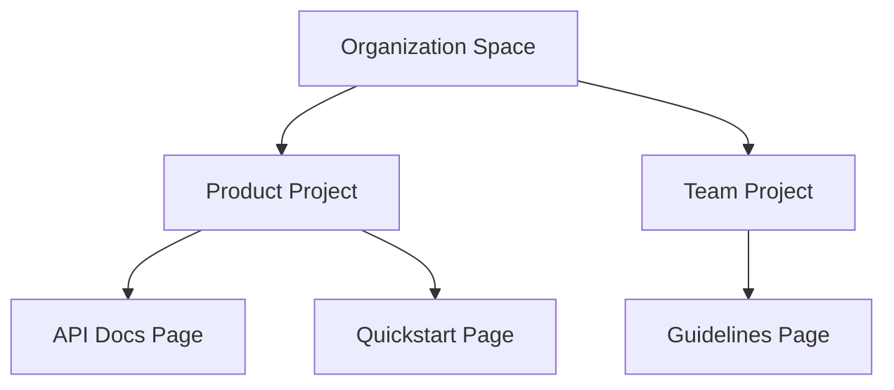

## Overview

Alexander Krakhotko provides a flexible system to organize your documentation effectively. You structure content using spaces, projects, and pages while applying tags for quick navigation. Maintain versions with built-in controls and export when needed. These concepts help you scale documentation as your projects grow.

<Columns cols={3}>
  <Card title="Spaces & Projects" icon="layers" href="#hierarchy">
    Build nested hierarchies for teams and initiatives.
  </Card>
  <Card title="Tagging System" icon="tag" href="#tagging">
    Categorize content dynamically.
  </Card>
  <Card title="Version Control" icon="git-branch" href="#version-control">
    Track changes without external tools.
  </Card>
</Columns>

## Documentation Hierarchy

Organize content in a clear hierarchy: spaces contain projects, and projects hold pages. Create a top-level space for your organization, then add projects for specific products or teams.



Use this structure to delegate access: assign viewers or editors at the project level.

<Steps>
  <Step title="Create a Space" icon="plus">
    Navigate to your dashboard and select `New Space`. Name it after your organization.
  </Step>
  <Step title="Add Projects" icon="folder">
    Inside the space, create projects like `Core API` or `User Guides`.
  </Step>
  <Step title="Organize Pages" icon="file-text">
    Drag and drop pages within projects to set the order.
  </Step>
</Steps>

## Tagging and Categorization

Tags enable cross-project search and filtering. Categories provide fixed groupings.

<Tabs>
  <Tab title="Tags" icon="tag">
    Apply free-form tags like `api`, `beta`, or `internal`.

    <CodeGroup tabs="MDX,YAML">
    ````mdx
    ---
    tags: ["api", "v2"]
    ---
    ````
    ```yaml
    tags:
      - api
      - v2
    ```
    </CodeGroup>
  </Tab>
  <Tab title="Categories" icon="list">
    Define categories in space settings for structured navigation.

    Set up via UI: `Space Settings > Categories > Add "Tutorials"`.
  </Tab>
</Tabs>

<Callout kind="tip">
  Combine tags and categories: use categories for broad groups and tags for specifics like versions or status.
</Callout>

## Version Control for Documents

Track changes directly in Alexander Krakhotko. Enable versioning per page to create snapshots.

<Expandable title="Version Workflow" default-open="true">
  Commit changes with messages, compare diffs, and rollback if needed.

  ```javascript
  // Example: Programmatic version via API
  await alexanderClient.pages.update({
    id: "doc-123",
    content: newContent,
    message: "Add authentication section"
  });
  ```
</Expandable>

## Exporting and Archiving Options

Export spaces for backups or migrations. Archive inactive projects to keep your dashboard clean.

| Option       | Format      | Use Case                  |
|--------------|-------------|---------------------------|
| Full Export | ZIP/MDX    | Backup entire space      |
| Page Export | PDF/MD     | Share single document    |
| Archive     | Internal   | Hide without deleting    |

<Callout kind="info">
  Exports include all tags and hierarchy. Schedule automated exports in space settings for compliance.
</Callout>

Follow these practices to keep your documentation scalable and searchable. Start by auditing your current structure and applying tags consistently.